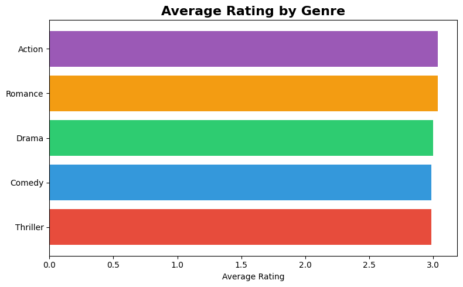
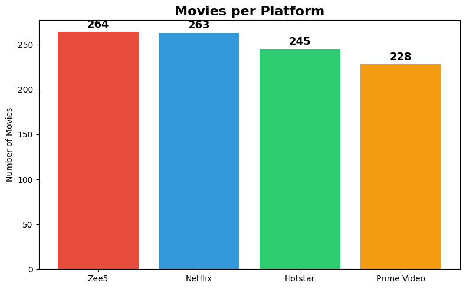
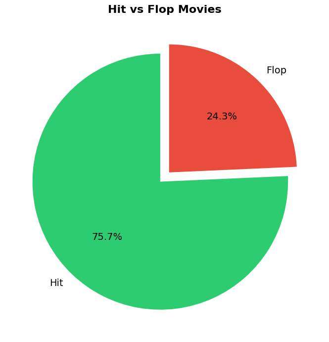
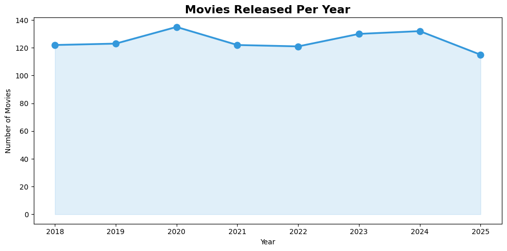

# 🎬 MovieLens AI – Smart Movie Analytics Pipeline
A simple **Data Engineering + Agentic AI** project that generates movie data, cleans it using an ETL pipeline, and uses a **Smart AI Agent** to answer questions automatically – with visual dashboard charts.
---
## 🛠️ How It Works
**Raw Movie Data → ETL Pipeline → Clean Data → Smart AI Agent → Dashboard Charts**

| Step | What Happens |
| :--- | :--- |
| 1. Generate Data | Creates 1000 movie records with ratings, budget & revenue |
| 2. ETL Pipeline | Cleans data, classifies Hit/Flop, adds rating categories |
| 3. AI Agent | Answers movie questions from the data |
| 4. Visualization | Creates 4 dashboard charts |

---
## 🧩 Features
* ✅ Generates 1000 movie records (30 titles, 5 genres, 4 platforms)
* ✅ ETL Pipeline (**Extract → Transform → Load**)
* ✅ Hit/Flop classification based on revenue vs budget
* ✅ Rating categorization (Excellent, Good, Average, Poor)
* ✅ Smart AI Agent – answers questions in plain English
* ✅ 4 dashboard charts
* ✅ No API key needed – works 100% offline
---
## 🚀 Tech Stack

| Technology | Used For |
| :--- | :--- |
| Python | Core programming |
| Pandas | Data processing & ETL |
| Matplotlib | Chart generation |
| Agentic AI | Smart query agent |

---
## 🤖 AI Agent – Sample Q&A
**Q: What is the top genre by rating?** **A:** Best Genre: Drama (Avg Rating: 3.1)
**Q: Which is the best movie by revenue?** **A:** Top Movie: Blood Moon (Revenue: Rs.200.0Cr)
**Q: How many total movies?** **A:** Total Movies: 1,000
**Q: What is the hit rate?** **A:** Hit Rate: 74.1% (741 out of 1000)
**Q: Which is the best platform?** **A:** Best Platform: Prime Video (Avg Rating: 3.1)
---
## 📊 Dashboard Charts
### Average Rating by Genre

### Movies per Platform

### Hit vs Flop Movies

### Movies Released Per Year

---
## 📈 Key Insights

| Metric | Value |
| :--- | :--- |
| Total Movies | 1,000 |
| Average Rating | 3.0 / 5.0 |
| Hit Rate | 74.1% |
| Top Genre | Drama |
| Top Movie | Blood Moon (Rs.200Cr) |
| Best Platform | Prime Video |

---
## 🚀 How to Run

pip install pandas matplotlib
python main.py

---

Project Structure

movielens-ai/
├── main.py              <- All code
├── README.md            <- This file
├── requirements.txt     <- Dependencies
├── movies_data.csv      <- Dataset
├── chart_genre_rating.png <- Chart 1
├── chart_platform.png   <- Chart 2
├── chart_hit_flop.png   <- Chart 3
└── chart_yearly.png     <- Chart 4

👤 Author
Gunavant Rumne – Data Engineer at LTIMindtree
📧 rumnegunavant@gmail.com
🔗 https://www.linkedin.com/in/gunavant-rumne-bb33a0172/
